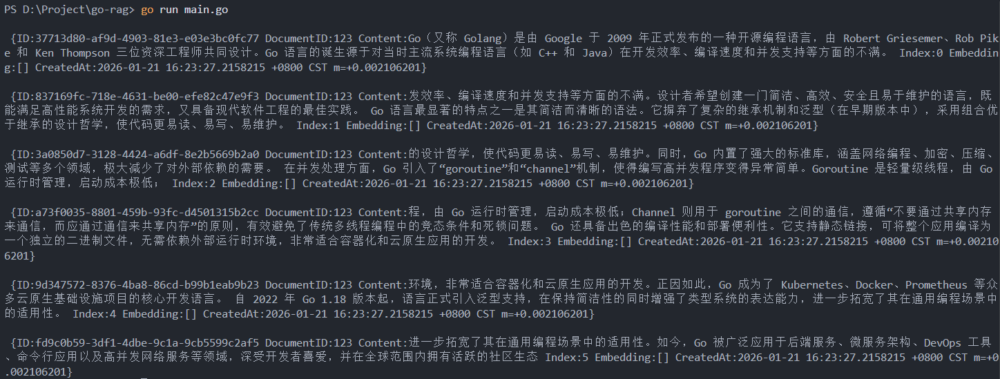
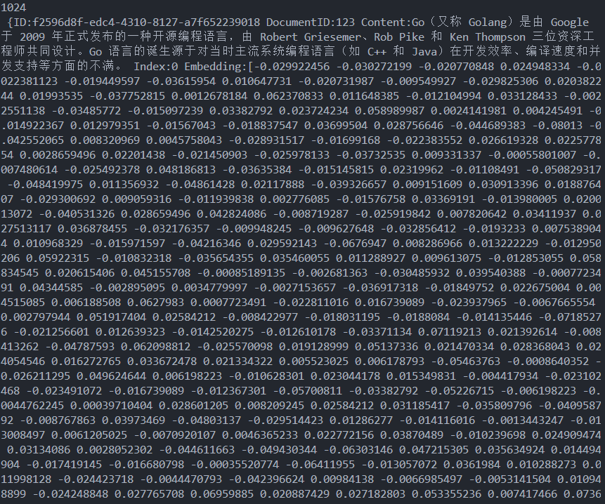

# GO-RAG
尝试使用Go语言编写一个RAG问答系统

## 项目架构
>使用Gin框架搭建后端，在后端中集成RAG功能。前端比较简易，使用Gin框架对前端页面进行静态托管 

技术栈：</br>
- 后端框架：Gin   </br>
- 前端：Gin静态托管HTML文件 </br>
- Docker容器化

RAG：
- 数据分块：`gojieba`
- 向量化Embedding模型：`待定`
- 向量存储：Qdrant向量数据库
- Chat模型：`待定`

> 为了实现的RAG的纯粹性，先不引入鉴权


## 实现
### RAG
#### chunker
分割策略:固定长度切分,同时在标点符号处切分 

测试效果: <br/>


#### embedder

分为`embeddingClient`和`embedder`两个部分

`embeddingClient`：负责发送embedding请求，接收响应并返回 <br/>

`embedder`：是整个pipeline中的embed组件，负责接收前一节点的文本，调用`embeddingClient`进行向量化，并将向量结果发送给下一节点 <br/>

测试效果：



#### store
接入Qdrant向量库实现 <br/>

目前的搜索逻辑非常简单：基于余弦相似度，返回`top-K`个分数最高的向量
```
文档入库流程：
Document → Chunker → Chunks → Embedder → Vectors → Qdrant.AddChunks()
                                                         ↓
                                                    Points (id, vector, payload)

查询流程：
Query → Embedder → QueryVector → Qdrant.Search() → Top-K Results
                                                      ↓
                                         RetrievalResult[chunk, score]

删除流程：
DocumentID → Qdrant.Delete() → Filter by document_id → Delete Points
```

测试效果：
```go
query := "什么是Golang"
	embeddedQuery, err := embedder.EmbedQuery(query)
	if err != nil {
		log.Fatalf("向量化query失败: %v", err)
	}
	results, err := store.Search(embeddedQuery, 3)
	if err != nil {
		log.Fatalf("查询失败: %v", err)
	}
```

